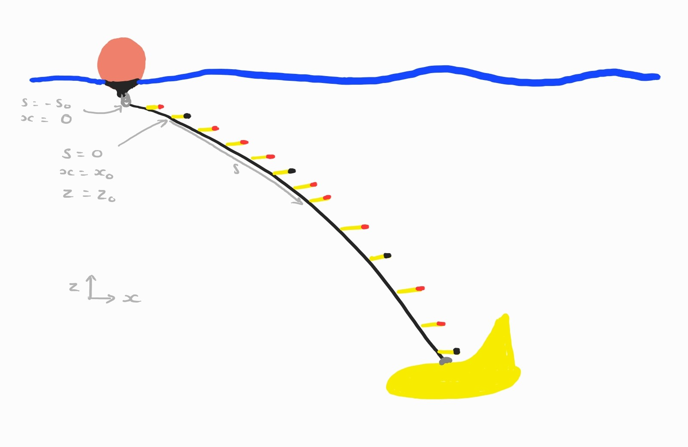

# Chain Models

## Catenary Model

A chain hanging under its own weight forms a catenary. It satisfies

$$ \frac{\mathrm{d}z}{\mathrm{d}x} = \frac{s}{a} $$

where $s$ is the arclength along the curve measured from the lowest point and $a$ is the length scale of the catenary. We will require that the catenary passes through $x=0$, $z=0$ at the surface. However, the lowest point of the catenary is not a very conveninent place to measure the arclength from as it's beyond the end of the chain. Therefore, we will redefine the arclength, $s$, such that $s = 0$ at the first pressure sensor. This pressure sensor will have coordinates $(x_0,z_0)$. A more natural choice might be to define $s = 0$ at $(0,0)$. However, this point lies somewhere inside the the buoy and an unknown distance from the sensors. Furthermore, when using the first pressure sensor we know $z_0$ exactly if we require that the catenary passes through that point. Alternatively, if we do not wish to single out the first pressure sensor as special, we could leave $z_0$ as an additional parameter to be found through the minimisation. However, the minimisation is already very expensive. Finally, we should note that there is nothing special about the choice of the first pressure sensor, the exact same reasoning will work for any of the pressure sensors on the chain.

 

The chain now satisfies 

$$ \frac{\mathrm{d}z}{\mathrm{d}x} = \frac{s - b}{a} $$

with $x = x_0$, $z = z_0$ at $s = 0$ and $x = 0$ at $z = 0$.

$b$ is the arclength from the first pressure sensor to where the catenary is horizontal (beyond the end of the chain).

 We need to solve for $a$ and $b$.

 The chain is always angled downwards but the slope becomes shallower as we go down the chain ($s$ increasing). Therefore, $a$ is a positive constant and $b - s > 0$ for all points on the chain.

 ### Catenary Solution

 The arclength satisfies

 $$ \frac{\mathrm{d}s}{\mathrm{d}x} = \sqrt{1 + \left(\frac{\mathrm{d}z}{\mathrm{d}x}\right)^2} = \sqrt{1 + \left(\frac{b - s}{a}\right)^2} \tag{$\dagger$}$$

 and hence 

$$ \frac{\mathrm{d}z}{\mathrm{d}s} = \frac{s - b}{\sqrt{a^2 + (b - s)^2}} $$ 

Solving for $z$ gives 

$$ z - z_0 = \sqrt{a^2 + (b - s)^2} - \sqrt{a^2 + b^2} \tag{$\ddagger$} $$

and inverting ($\dagger$) then integrating gives

$$ x - x_0 = a\left(\mathrm{arcsinh}\left(\frac{b}{a}\right) - \mathrm{arcsinh}\left(\frac{b - s}{a}\right)\right) $$

### Determining Parameters 

$z_0$ is known and we just need to find $a$ and $b$ given $z$ and $s$. First, introduce $c = \sqrt{a^2 + b^2}$ and $z' = z - z_0$ then eliminate $a$ from ($\ddagger$). 

$$ z' = \sqrt{s^2 - 2bs + c^2} - c $$

Given two points, $(s_1,z'_1)$ and $(s_2,z'_2)$, on the catenary we can solve for $b$ and $c$.

$$ (z'_i + c)^2 = s_i^2 -2b s_i + c^2 $$

$$ {z'}_i^2 + 2z_i c = s_i^2 - 2s_i b $$

$$s_i b + z'_i c = \frac{1}{2}s_i^2 - {z'}_i^2 $$

$$ \begin{pmatrix} b \\ c \end{pmatrix} = \mathbf{A}^{-1}\mathbf{y} $$

where 

$$ \mathbf{A} = \begin{pmatrix}
    s_1 & z'_1 \\ s_2 & z'_2 \end{pmatrix}, \quad 
    \mathbf{y} = \frac{1}{2}\begin{pmatrix}s_1^2 - {z'}_1^2 \\
        s_2^2 - {z'}_2^2 \end{pmatrix} $$

Finally, we need to solve for $x_0$. We specify that the catenary passes through $x = 0$, $z = 0$ at some $s = s_0 < 0$. Therefore, $s_0$ satisfies 

$$ -z_0 = \sqrt{s_0^2 - 2bs_0 + c^2} - c $$

Solving for $s_0$ gives 

$$ s_0 = \frac{b - \sqrt{b^2 + 4z_0^2 -8z_0 c}}{2} $$

and 

$$ x_0 = a\left(\mathrm{arcsinh}\left(\frac{b - s_0}{a}\right) - \mathrm{arcsinh}\left(\frac{b}{a}\right)\right) $$

Thus

$$ x = a\left(\mathrm{arcsinh}\left(\frac{b - s_0}{a}\right) - \mathrm{arcsinh}\left(\frac{b - s}{a}\right)\right) $$

### Numerical Solution

Given some points, $(s_i, z'_i)$, $i = 1 , \dots, N $ with $N > 2$, on the chain, not including the first pressure sensor, we need to find the values of $b$ and $c$ that minimise 

$$ r = \frac{1}{N}\sum_{i = 1}^N (z'(s_i) - z'_i)^2 $$

This is a non-linear optimisation which we will solve using the _'trust-region'_ algorithm from the MATLAB optimization toolbox. This requires the gradient and Hessian of $r$.

$$ \frac{\partial r}{\partial b} = \frac{1}{N}\sum_{i = 1}^N 2(z'(s_i) - z'_i)\left(\frac{-s_i}{\sqrt{s_i^2 - 2s_i b + c^2}}\right) $$ 

$$ \frac{\partial r}{\partial c} = \frac{1}{N}\sum_{i = 1}^N 2(z'(s_i) - z'_i)\left(\frac{c}{\sqrt{s_i^2 - 2s_i b + c^2}} - 1\right) $$ 

$$ \frac{\partial^2 r}{\partial b^2} = \frac{1}{N}\sum_{i = 1}^N 2\left(\frac{-s_i}{\sqrt{s_i^2 - 2s_i b + c^2}}\right)^2 + 2(z'(s_i) - z'_i)\left(\frac{-s_i^2}{\sqrt{s_i^2 - 2s_i b + c^2}^3}\right)$$

$$ \frac{\partial^2 r}{\partial b\partial c} = \frac{1}{N}\sum_{i = 1}^N 2\left(\frac{c}{\sqrt{s_i^2 - 2s_i b + c^2}} - 1\right)\left(\frac{-s_i}{\sqrt{s_i^2 - 2s_i b + c^2}}\right) + 2(z'(s_i) - z'_i)\left(\frac{s_i c}{\sqrt{s_i^2 - 2s_i b + c^2}^3}\right) $$

$$ \frac{\partial^2 r}{\partial c^2} = \frac{1}{N}\sum_{i = 1}^N 2\left(\frac{c}{\sqrt{s_i^2 - 2s_i b + c^2}} - 1\right)^2 + 2(z'(s_i) - z'_i)\left(\frac{-c^2}{\sqrt{s_i^2 - 2s_i b + c^2}^3} + \frac{1}{\sqrt{s_i^2 - 2s_i b + c^2}}\right)$$ 

$$ = \frac{1}{N}\sum_{i = 1}^N 2\left(\frac{c}{\sqrt{s_i^2 - 2s_i b + c^2}} - 1\right)^2 + 2(z'(s_i) - z'_i)\left(\frac{s_i^2 - 2s_i b}{\sqrt{s_i^2 - 2s_i b + c^2}^3}\right) $$

We also require an initial guess which we get by computing $b$ and $c$ for every pair of points and then taking the median values.

